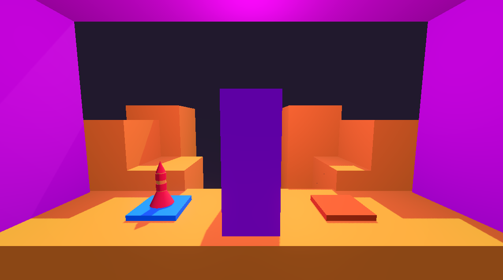
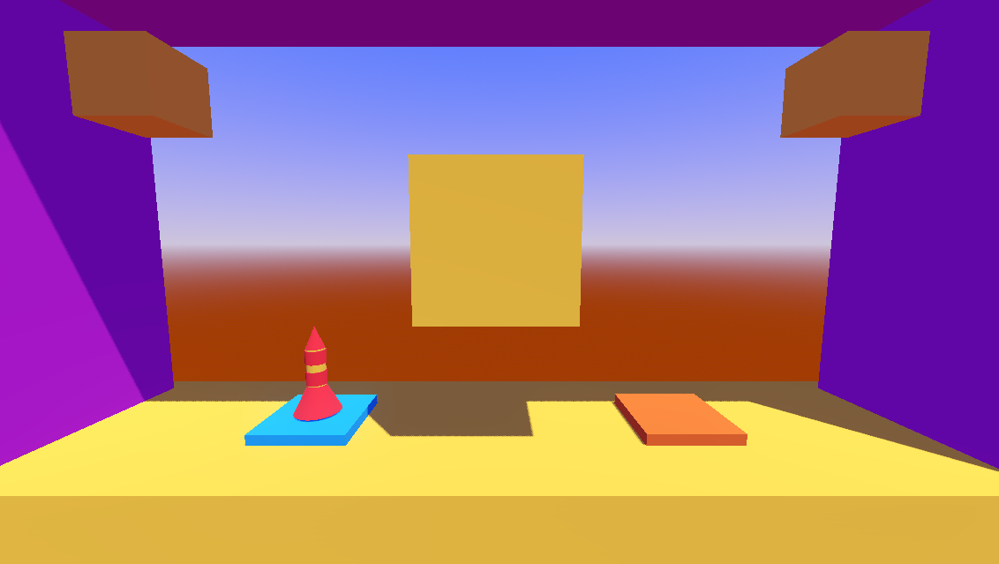

# Project Boost "Rocket Ship Physics Game"

* A 3D physics game where the player must land on the orange landing pad to proceed to next level

## Features of Game:
* Challenging levels
* Moving objects
* Object triggers
* Multiple levels
* Directional lights
* Particle/Sound effects upon: flying, dying, and winning

# Screenshots

